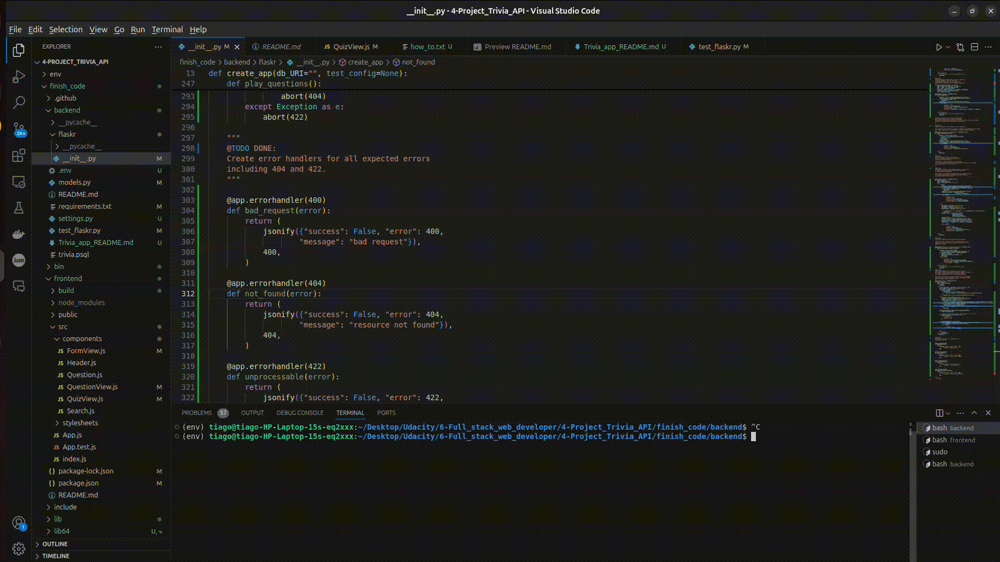

# Udacity_Fullstack_Web_developer_nanodegree

## Summary
The Full Stack Web Developer Nanodegree program equips students with the essential skills to build and deploy 
dynamic web applications. Through hands-on projects, learners gain proficiency in front-end technologies like 
HTML, CSS, and JavaScript, as well as back-end frameworks such as Flask and SQLAlchemy. 
The curriculum covers RESTful APIs, database management, and deployment strategies, enabling students to create 
robust applications that can handle user interactions and data storage.

## 1 - Project Fyyur

Fyyur is a web application designed to help users discover and manage live music events. Built using Flask and 
SQLAlchemy, this project allows users to create, view, and manage events, as well as register for them. 
The application features user authentication, event filtering, and a responsive design to enhance the user experience. 
Fyyur serves as a practical demonstration of the application of Flask and SQLAlchemy, with creation and managing of a 
database in the backend, ensuring that the data is checked before it is passed to the database.

## 2 - Trivia App

The Trivia App allows users to play quizzes by answering questions that are organized into different categories. The app provides functionality for:

* Retrieving questions from a PostgreSQL database.
* Filtering questions by category.
* Searching for questions based on keywords.
* Adding new questions.
* Deleting questions.
* Playing a quiz by randomly selecting questions from specific categories.

The backend is developed using Python and Flask, while the database is managed with PostgreSQL.  
The application is designed to follow RESTful API principles and includes unit tests for verifying its functionality.

#include <string>
/*-------------------------------------------------------------------------|
|                         Own Component Includes                           |
|-------------------------------------------------------------------------*/
#include "KNETxDEF/KNETxDEFtyp.hpp"
#include "KNETxLODRxQRYxWRAPPER_lib.hpp"
/*-------------------------------------------------------------------------|
|                       Other Components Includes                          |
|-------------------------------------------------------------------------*/
#include "LODRxTCRxDMD/LODRxTCRxDMD_data_gen_ServiceBundle.hpp"
#include "THXA/THXA_Trace.hpp"

#define CC "KNET"

/** \brief Implementation of convertImageForWaferIdToTaskGenericImageId()
 */
std::string KNETxLODRxQRYxWRAPPER::Impl::convertImageForWaferIdToTaskGenericImageId(
   const std::string& image_for_wafer_id)
{
   LODR::Data::iTwinscanCoreDM::ImageForWaferEntityId img_uuid(
      boost::lexical_cast<boost::uuids::uuid>(image_for_wafer_id));
   auto TSCORServiceBundlePtr = LODR::Data::iTwinscanCoreDM::getServiceBundle();
   if(TSCORServiceBundlePtr == nullptr)
   {
      throw std::runtime_error("Unable to get LODR service bundle.");
   }
   std::string tg_image_for_wafer_id = boost::lexical_cast<std::string>(
      TSCORServiceBundlePtr->getReadAccessForImageForWaferReferenceRepo()->get(img_uuid)->getTgImageForWafer());
   THXA_TRACE_ENTRY(KNETxDEF::TRACE_NAME,
                    THXA_TRACE_INT,
                    "image id: %s, tg_image_for_wafer_id: %s",
                    image_for_wafer_id,
                    tg_image_for_wafer_id);
   return tg_image_for_wafer_id;
}

/** \brief Implementation of convertExposureIdToImageForWaferId()
 */
std::string KNETxLODRxQRYxWRAPPER::Impl::convertExposureIdToImageForWaferId(const std::string& exposure_id)
{
   auto TSCORServiceBundlePtr = LODR::Data::iTwinscanCoreDM::getServiceBundle();
   if(TSCORServiceBundlePtr == nullptr)
   {
      throw std::runtime_error("Unable to get LODR service bundle.");
   }
   LODR::Data::iTwinscanCoreDM::ExposurePtr lodr_exposure_ptr =
      TSCORServiceBundlePtr->getReadAccessForExposureReferenceRepo()->get(
         LODR::Data::iTwinscanCoreDM::ExposureEntityId(boost::lexical_cast<boost::uuids::uuid>(exposure_id)));
   if(lodr_exposure_ptr == nullptr)
   {
      throw std::runtime_error("Unable to retrieve exposure from LODR.");
   }
   auto img_for_wafer_id = boost::lexical_cast<std::string>(lodr_exposure_ptr->getImage());
   THXA_TRACE_ENTRY(
      KNETxDEF::TRACE_NAME, THXA_TRACE_INT, "Found image_id: %s, for exposure %s", img_for_wafer_id, exposure_id);
   return img_for_wafer_id;
}

/** \brief Implementation of convertTaskGenericExposureIdToTaskGenericImageForWaterId()
 */
std::string KNETxLODRxQRYxWRAPPER::Impl::convertTaskGenericExposureIdToTaskGenericImageForWaterId(
   const std::string& tg_exposure_id)
{
   LODR::Data::iTwinscanCoreDM::TaskGenericExposureEntityId lodr_id(
      boost::lexical_cast<boost::uuids::uuid>(tg_exposure_id));
   auto TSCORServiceBundlePtr = LODR::Data::iTwinscanCoreDM::getServiceBundle();
   if(TSCORServiceBundlePtr == nullptr)
   {
      throw std::runtime_error("Unable to get LODR service bundle.");
   }
   auto lodr_exposure = TSCORServiceBundlePtr->getReadAccessForTaskGenericExposureReferenceRepo()->get(lodr_id);
   if(lodr_exposure == nullptr)
   {
      throw std::runtime_error("Unable to retrieve exposure from LODR.");
   }
   std::string tg_image_for_wafer_id = lodr_exposure->getTgImageForWafer().toString();
   THXA_TRACE_ENTRY(KNETxDEF::TRACE_NAME,
                    THXA_TRACE_INT,
                    "KNET LODR Wrapper: Found Task Generic Image For Wafer (%s) for Task Generic Exposure (%s)",
                    tg_image_for_wafer_id,
                    tg_exposure_id);
   return tg_image_for_wafer_id;
}

/** \brief Implementation of convertExposureIdToTaskGenericExposureId()
 */
std::string KNETxLODRxQRYxWRAPPER::Impl::convertExposureIdToTaskGenericExposureId(const std::string& exposure_id)
{
   LODR::Data::iTwinscanCoreDM::ExposureEntityId lodr_id(boost::lexical_cast<boost::uuids::uuid>(exposure_id));
   auto TSCORServiceBundlePtr = LODR::Data::iTwinscanCoreDM::getServiceBundle();
   if(TSCORServiceBundlePtr == nullptr)
   {
      throw std::runtime_error("Unable to get LODR service bundle.");
   }
   auto lodr_exposure = TSCORServiceBundlePtr->getReadAccessForExposureReferenceRepo()->get(lodr_id);
   if(lodr_exposure == nullptr)
   {
      throw std::runtime_error("Unable to retrieve exposure from LODR.");
   }
   std::string tg_exposure_id = lodr_exposure->getTgExposure().toString();
   THXA_TRACE_ENTRY(KNETxDEF::TRACE_NAME,
                    THXA_TRACE_INT,
                    "KNTP LODR Wrapper: Found Task Generic Exposure (%s) for Exposure (%s)",
                    tg_exposure_id,
                    exposure_id);
   return tg_exposure_id;
}

/** \brief Implementation of convertTaskGenericImageIdToImageId()
 */
std::string KNETxLODRxQRYxWRAPPER::Impl::convertTaskGenericImageIdToImageId(const std::string& tg_image_for_wafer_id)
{
   LODR::Data::iTwinscanCoreDM::TaskGenericImageForWaferEntityId lodr_id(
      boost::lexical_cast<boost::uuids::uuid>(tg_image_for_wafer_id));
   auto TSCORServiceBundlePtr = LODR::Data::iTwinscanCoreDM::getServiceBundle();
   if(TSCORServiceBundlePtr == nullptr)
   {
      throw std::runtime_error("Unable to get LODR service bundle.");
   }
   auto lodr_image_for_wafer =
      TSCORServiceBundlePtr->getReadAccessForTaskGenericImageForWaferReferenceRepo()->get(lodr_id);
   if(lodr_image_for_wafer == nullptr)
   {
      throw std::runtime_error("Unable to retrieve image for wafer from LODR.");
   }
   std::string img_for_wafer_id = lodr_image_for_wafer->getImageId();
   THXA_TRACE_ENTRY(KNETxDEF::TRACE_NAME,
                    THXA_TRACE_INT,
                    "KNET LODR Wrapper: Found Image (%s) for Task Generic Image For Wafer (%s)",
                    img_for_wafer_id,
                    tg_image_for_wafer_id);
   return img_for_wafer_id;
}

/** \brief Implementation of convertTaskGenericExposureIdToImageId()
 */
std::string KNETxLODRxQRYxWRAPPER::Impl::convertTaskGenericExposureIdToImageId(const std::string& tg_exposure_id)
{
   std::string tg_image_for_wafer_id = convertTaskGenericExposureIdToTaskGenericImageForWaterId(tg_exposure_id);
   std::string img_for_wafer_id = convertTaskGenericImageIdToImageId(tg_image_for_wafer_id);
   THXA_TRACE_ENTRY(KNETxDEF::TRACE_NAME,
                    THXA_TRACE_INT,
                    "KNET LODR Wrapper: Found Image (%s) for Task Generic Exposure (%s)",
                    img_for_wafer_id,
                    tg_exposure_id);
   return img_for_wafer_id;
}

#include <gtest/gtest.h>
#include <gmock/gmock.h>
#include <string>
#include <boost/uuid/uuid.hpp>
#include <boost/lexical_cast.hpp>

// Forward declarations (Replace actual LODR types with your mock types)
namespace LODR {
    namespace Data {
        namespace iTwinscanCoreDM {
            class ServiceBundle;
            class ImageForWaferEntityId;
            class Exposure;
            class TaskGenericExposureEntityId;
            class TaskGenericImageForWaferEntityId;
        }
    }
}

###############################################################################################################################

// Mock classes using Google Mock
class MockServiceBundle {
public:
    MOCK_METHOD0(getReadAccessForImageForWaferReferenceRepo, std::shared_ptr<MockImageForWaferRepo>());
    MOCK_METHOD0(getReadAccessForExposureReferenceRepo, std::shared_ptr<MockExposureRepo>());
    MOCK_METHOD0(getReadAccessForTaskGenericExposureReferenceRepo, std::shared_ptr<MockTaskGenericExposureRepo>());
    MOCK_METHOD0(getReadAccessForTaskGenericImageForWaferReferenceRepo, std::shared_ptr<MockTaskGenericImageForWaferRepo>());
};

class MockImageForWaferRepo {
public:
    MOCK_METHOD1(get, std::shared_ptr<MockImageForWafer>(const LODR::Data::iTwinscanCoreDM::ImageForWaferEntityId&));
};

class MockExposureRepo {
public:
    MOCK_METHOD1(get, std::shared_ptr<MockExposure>(const LODR::Data::iTwinscanCoreDM::ExposureEntityId&));
};

class MockTaskGenericExposureRepo {
public:
    MOCK_METHOD1(get, std::shared_ptr<MockExposure>(const LODR::Data::iTwinscanCoreDM::TaskGenericExposureEntityId&));
};

class MockTaskGenericImageForWaferRepo {
public:
    MOCK_METHOD1(get, std::shared_ptr<MockTaskGenericImageForWafer>(const LODR::Data::iTwinscanCoreDM::TaskGenericImageForWaferEntityId&));
};

// Mocking specific return values
class MockImageForWafer {
public:
    MOCK_METHOD(std::string, getTgImageForWafer, (), (const));
};

class MockExposure {
public:
    MOCK_METHOD(std::string, getImage, (), (const));
    MOCK_METHOD(std::string, getTgExposure, (), (const));
};

class MockTaskGenericImageForWafer {
public:
    MOCK_METHOD(std::string, getImageId, (), (const));
};

class KNETxLODRxQRYxWRAPPERTest : public ::testing::Test {
protected:
    std::shared_ptr<MockServiceBundle> mockServiceBundle;
    KNETxLODRxQRYxWRAPPER::Impl wrapper;

    void SetUp() override {
        mockServiceBundle = std::make_shared<MockServiceBundle>();
    }
};

TEST_F(KNETxLODRxQRYxWRAPPERTest, convertImageForWaferIdToTaskGenericImageId_Success) {
    // Arrange
    std::string image_for_wafer_id = "uuid-1234-5678";
    boost::uuids::uuid uuid = boost::lexical_cast<boost::uuids::uuid>(image_for_wafer_id);

    // Create mock image for wafer
    auto mockImageForWafer = std::make_shared<MockImageForWafer>();
    EXPECT_CALL(*mockImageForWafer, getTgImageForWafer()).WillOnce(::testing::Return("task_generic_image"));

    // Mock the service bundle and repo return values
    auto mockImageRepo = std::make_shared<MockImageForWaferRepo>();
    EXPECT_CALL(*mockImageRepo, get(::testing::Eq(uuid))).WillOnce(::testing::Return(mockImageForWafer));

    EXPECT_CALL(*mockServiceBundle, getReadAccessForImageForWaferReferenceRepo()).WillOnce(::testing::Return(mockImageRepo));

    // Act
    std::string result = wrapper.convertImageForWaferIdToTaskGenericImageId(image_for_wafer_id);

    // Assert
    EXPECT_EQ(result, "task_generic_image");
}

TEST_F(KNETxLODRxQRYxWRAPPERTest, convertExposureIdToImageForWaferId_Success) {
    // Arrange
    std::string exposure_id = "uuid-1234-5678";
    boost::uuids::uuid uuid = boost::lexical_cast<boost::uuids::uuid>(exposure_id);

    auto mockExposure = std::make_shared<MockExposure>();
    EXPECT_CALL(*mockExposure, getImage()).WillOnce(::testing::Return("image_for_wafer_id"));

    auto mockExposureRepo = std::make_shared<MockExposureRepo>();
    EXPECT_CALL(*mockExposureRepo, get(::testing::Eq(uuid))).WillOnce(::testing::Return(mockExposure));

    EXPECT_CALL(*mockServiceBundle, getReadAccessForExposureReferenceRepo()).WillOnce(::testing::Return(mockExposureRepo));

    // Act
    std::string result = wrapper.convertExposureIdToImageForWaferId(exposure_id);

    // Assert
    EXPECT_EQ(result, "image_for_wafer_id");
}

TEST_F(KNETxLODRxQRYxWRAPPERTest, convertTaskGenericExposureIdToTaskGenericImageForWaterId_Success) {
    // Arrange
    std::string tg_exposure_id = "uuid-1234-5678";
    boost::uuids::uuid uuid = boost::lexical_cast<boost::uuids::uuid>(tg_exposure_id);

    auto mockExposure = std::make_shared<MockExposure>();
    EXPECT_CALL(*mockExposure, getTgExposure()).WillOnce(::testing::Return("tg_exposure_id"));

    auto mockExposureRepo = std::make_shared<MockTaskGenericExposureRepo>();
    EXPECT_CALL(*mockExposureRepo, get(::testing::Eq(uuid))).WillOnce(::testing::Return(mockExposure));

    EXPECT_CALL(*mockServiceBundle, getReadAccessForTaskGenericExposureReferenceRepo()).WillOnce(::testing::Return(mockExposureRepo));

    // Act
    std::string result = wrapper.convertTaskGenericExposureIdToTaskGenericImageForWaterId(tg_exposure_id);

    // Assert
    EXPECT_EQ(result, "tg_exposure_id");
}

TEST_F(KNETxLODRxQRYxWRAPPERTest, convertTaskGenericImageIdToImageId_Success) {
    // Arrange
    std::string tg_image_for_wafer_id = "uuid-1234-5678";
    boost::uuids::uuid uuid = boost::lexical_cast<boost::uuids::uuid>(tg_image_for_wafer_id);

    auto mockImageForWafer = std::make_shared<MockTaskGenericImageForWafer>();
    EXPECT_CALL(*mockImageForWafer, getImageId()).WillOnce(::testing::Return("image_for_wafer_id"));

    auto mockImageRepo = std::make_shared<MockTaskGenericImageForWaferRepo>();
    EXPECT_CALL(*mockImageRepo, get(::testing::Eq(uuid))).WillOnce(::testing::Return(mockImageForWafer));

    EXPECT_CALL(*mockServiceBundle, getReadAccessForTaskGenericImageForWaferReferenceRepo()).WillOnce(::testing::Return(mockImageRepo));

    // Act
    std::string result = wrapper.convertTaskGenericImageIdToImageId(tg_image_for_wafer_id);

    // Assert
    EXPECT_EQ(result, "image_for_wafer_id");
}

